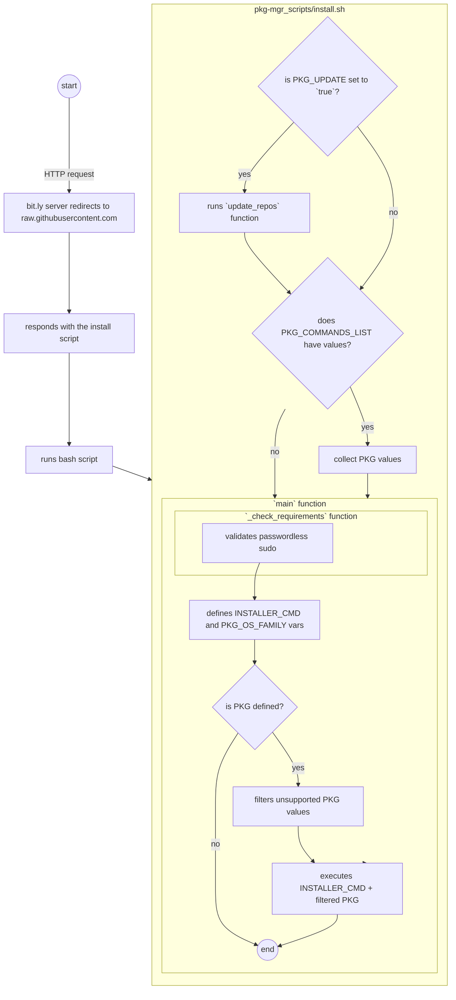

# cURL package installer
<!-- markdown-link-check-disable-next-line -->
[](https://opensource.org/licenses/Apache-2.0)
[](https://img.shields.io/docker/pulls/electrocucaracha/pkg_mgr-init)
[](https://github.com/marketplace/actions/super-linter)
<!-- markdown-link-check-disable-next-line -->


This project pretends to centralize and facilitate the process to
install and configure some Linux projects on major different Linux
Distributions.

Why using curl instead of wget? Daniel Stenberg [explains](https://daniel.haxx.se/docs/curl-vs-wget.html)
that curl works like a traditional Unix `cat` command and can do a
single-shot transfer data

Why not using configuration management tools like [Ansible](https://www.ansible.com/),
[Puppet](https://puppet.com) or [Chef](https://www.chef.io/)? These
great tools require an initial installation step for its operation
which results in additional undesired packages in the OS.

## Supported distributions

| Name       | Version           |
|:-----------|:-----------------:|
| Ubuntu     | 16.04/18.04/20.04 |
| CentOS     | 7/8 Stream        |
| OpenSUSE   | Tumbleweed/Leap   |

## How to use this script?

The [install.sh](install.sh) bash script has been created to abstract
the differences between different Linux distributions. For example, in
order to install and configure Docker service the following
instruction is needed:

```bash
curl -fsSL http://bit.ly/install_pkg | PKG="docker docker-compose" bash
```



`bit.ly/install_pkg` redirects to the install script in this repository and the invocation above is equivalent to:

```bash
curl -fsSL https://raw.githubusercontent.com/electrocucaracha/pkg-mgr_scripts/master/install.sh | PKG="docker docker-compose" bash
```

### Program environment variables

| Name         | Description                                                               |
|:-------------|:--------------------------------------------------------------------------|
| PKG          | Package name(s) to be installed on the requester.(String value)           |
| PKG_UPDATE   | Update package manager metadata information.(Boolean value)               |
| PKG_DEBUG    | Enable verbose output during the execution.(Boolean value)                |

### Bindep usage

The cURL package installer can be combined with [bindep tool][1] to
perform multiOS installations. The following example demostrates how
to install the [Portable Hardware Locality tools][2] in the current
machine.

```bash
curl -fsSL http://bit.ly/install_pkg | PKG=bindep bash

cat << EOF > bindep.txt
hwloc [node]
hwloc-lstopo [node platform:suse]
EOF
curl -fsSL http://bit.ly/install_pkg | PKG="$(bindep node -b)" bash

lstopo-no-graphics
```

Or use the [wrapper script][3] provided to run in a single command

```bash
curl -fsSL http://bit.ly/install_bin | PKG_BINDEP_PROFILE=node bash
```

### Installing multiple commands

It's also possible to install multiple command-line tools with a single
cURL call. The following example will install docker, kind and kubectl
commands.

```bash
curl -fsSL http://bit.ly/install_pkg | PKG_COMMANDS_LIST="docker,kind,kubectl" bash
```

[1]: https://docs.openstack.org/infra/bindep/
[2]: https://www.open-mpi.org/projects/hwloc/
[3]: bindep_install.sh
