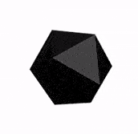

# Crystal



It's a general-purpose, object-oriented programming language with
syntax inspired by the language Ruby,it is a compiled language with
static type-checking, but specifying the types of variables or method
arguments is generally unneeded. Types are resolved by an advanced
global type inference algorithm.

## Operating System Support Matrix

| Name       | Version    | Supported |
|:-----------|:----------:|:---------:|
| Ubuntu     | 16.04      | [x]       |
| Ubuntu     | 18.04      | [x]       |
| Ubuntu     | 20.04      | [x]       |
| CentOS     | 7          | [x]       |
| CentOS     | 8          | [x]       |
| OpenSUSE   | Tumbleweed | [x]       |
| OpenSUSE   | Leap       | [x]       |

## How to use it

```bash
curl -fsSL http://bit.ly/install_pkg | PKG=crystal-lang bash
```

### Environment variables

| Name               | Default | Description                              |
|:-------------------|:--------|:-----------------------------------------|

## Used by

- [Kubernetes Reference Deployment](https://github.com/electrocucaracha/krd)
