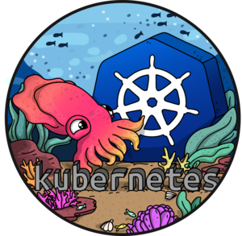

# Kubernetes command-line tool



kubectl allows you to run commands against Kubernetes clusters. You
can use kubectl to deploy applications, inspect and manage cluster
resources, and view logs.

## Krew


Krew is a tool that makes it easy to use kubectl plugins. Krew helps
you discover plugins, install and manage them on your machine. It is
similar to tools like apt, dnf or brew. Today, over 70 kubectl plugins
are available on Krew.

* For kubectl users: Krew helps you find, install and manage kubectl
plugins in a consistent way.
* For plugin developers: Krew helps you package and distribute your
plugins on multiple platforms and makes them discoverable.

## Operating System Support Matrix

| Name       | Version    | Supported |
|:-----------|:----------:|:---------:|
| Ubuntu     | 16.04      | [x]       |
| Ubuntu     | 18.04      | [x]       |
| Ubuntu     | 20.04      | [x]       |
| CentOS     | 7          | [x]       |
| CentOS     | 8          | [x]       |
| OpenSUSE   | Tumbleweed | [x]       |
| OpenSUSE   | Leap       | [x]       |

## How to use it

```bash
curl -fsSL http://bit.ly/install_pkg | PKG=kubectl bash
```
### Environment variables

| Name                  | Default                                         | Description                                   |
|:----------------------|:------------------------------------------------|:----------------------------------------------|
| PKG_KUBECTL_VERSION   |                                                 | Specifies the Kubectl version to be installed |
| PKG_KREW_VERSION      |                                                 | Specifies the Krew version to be installed    |
| PKG_KREW_PLUGINS_LIST | tree,access-matrix,score,sniff,view-utilization | List of Krew plugins to be installed          |

## Used by

- [K6 Grafana Dashboard](https://github.com/electrocucaracha/k6board)
- [Kubernetes Reference Deployment](https://github.com/electrocucaracha/krd)
- [Kubernetes NonPreemptingPriority gate feature demo](https://github.com/electrocucaracha/k8s-NonPreemptingPriority-demo)
- [GW Tester Demo](https://github.com/electrocucaracha/gw-tester)
- [Quality of Service classes (Demo)](https://github.com/electrocucaracha/k8s-SuspendResume-demo)
