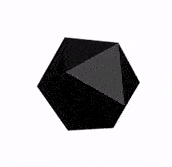

# Crystal



It's a general-purpose, object-oriented programming language with
syntax inspired by the language Ruby,it is a compiled language with
static type-checking, but specifying the types of variables or method
arguments is generally unneeded. Types are resolved by an advanced
global type inference algorithm.

## Operating System Support Matrix

| Name     |  Version   | Supported |
| :------- | :--------: | :-------: |
| Ubuntu   |   16.04    |    [ ]    |
| Ubuntu   |   18.04    |    [x]    |
| Ubuntu   |   20.04    |    [x]    |
| OpenSUSE | Tumbleweed |    [x]    |
| OpenSUSE |    Leap    |    [x]    |

## How to use it

```bash
curl -fsSL http://bit.ly/install_pkg | PKG=crystal-lang bash
```

### Environment variables

| Name | Default | Description |
| :--- | :------ | :---------- |

### [Dev Container](https://containers.dev/overview)

This script can be consumed as Development container "Feature" through the
following configuration:

```json
{
  "image": "mcr.microsoft.com/devcontainers/base:ubuntu",
  "features": {
    "ghcr.io/electrocucaracha/pkg-mgr_scripts/crystal-lang:latest": {}
  }
}
```

## Used by

- [Kubernetes Reference Deployment](https://github.com/electrocucaracha/krd)
