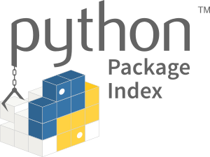

# pip



pip is a de facto standard package-management system used to install
and manage software packages written in Python. Many packages can be
found in the default source for packages and their dependencies —
Python Package Index (PyPI).

## Operating System Support Matrix

| Name     |  Version   | Supported |
| :------- | :--------: | :-------: |
| Ubuntu   |   16.04    |    [x]    |
| Ubuntu   |   18.04    |    [x]    |
| Ubuntu   |   20.04    |    [x]    |
| CentOS   |     7      |    [x]    |
| CentOS   |     8      |    [x]    |
| OpenSUSE | Tumbleweed |    [x]    |
| OpenSUSE |    Leap    |    [x]    |
| Debian   |     8      |    [ ]    |
| Debian   |     9      |    [x]    |
| Debian   |     10     |    [x]    |

## How to use it

```bash
curl -fsSL http://bit.ly/install_pkg | PKG=pip bash
```

### Environment variables

| Name                     | Default | Description                                        |
| :----------------------- | :------ | :------------------------------------------------- |
| PKG_PYTHON_MAJOR_VERSION | 3       | Specifies the Python major version to be installed |

## Used by

- [OpenStack Multi-Node Deployment](https://github.com/electrocucaracha/openstack-multinode)
- [CentOS Mirror Server](https://github.com/electrocucaracha/centos-mirror)
