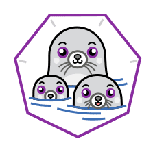

# podman



Podman is a daemonless container engine for developing, managing, and
running OCI Containers on your Linux System. Containers can either be
run as root or in rootless mode.

## Operating System Support Matrix

| Name     |  Version   | Supported |
| :------- | :--------: | :-------: |
| Ubuntu   |   16.04    |    [ ]    |
| Ubuntu   |   18.04    |    [x]    |
| Ubuntu   |   20.04    |    [x]    |
| OpenSUSE | Tumbleweed |    [x]    |
| OpenSUSE |    Leap    |    [x]    |

## How to use it

```bash
curl -fsSL http://bit.ly/install_pkg | PKG=podman bash
```

### Environment variables

| Name                     | Default         | Description                                 |
| :----------------------- | :-------------- | :------------------------------------------ |
| PKG_RUNC_VERSION         |                 | Specifies the runc version to be installed  |
| PKG_CRUN_VERSION         |                 | Specifies the crun version to be installed  |
| PKG_YOUKI_VERSION        |                 | Specifies the youki version to be installed |
| PKG_PODMAN_RUNTIMES_LIST | runc,crun,youki | List of runtimes to be installed            |

## Used by

- [Kubernetes Ingress Demo](https://github.com/electrocucaracha/k8s-Ingress-demo)
