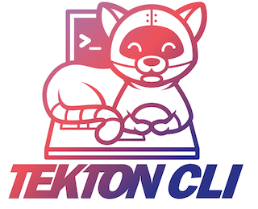

# Tekton Pipeline CLI



Tekton is a powerful and flexible open-source framework for creating
CI/CD systems, allowing developers to build, test, and deploy across
cloud providers and on-premise systems. The Tekton Pipelines CLI
project provides a common line interface for interacting with Tekton.

## Operating System Support Matrix

| Name     |  Version   | Supported |
| :------- | :--------: | :-------: |
| Ubuntu   |   16.04    |    [x]    |
| Ubuntu   |   18.04    |    [x]    |
| Ubuntu   |   20.04    |    [x]    |
| OpenSUSE | Tumbleweed |    [x]    |
| OpenSUSE |    Leap    |    [x]    |

## How to use it

```bash
curl -fsSL http://bit.ly/install_pkg | PKG=tkn bash
```

### Environment variables

| Name            | Default | Description                               |
| :-------------- | :------ | :---------------------------------------- |
| PKG_TKN_VERSION |         | Specifies the tkn version to be installed |

## Used by

- [Release Engineering](https://github.com/electrocucaracha/releng)
